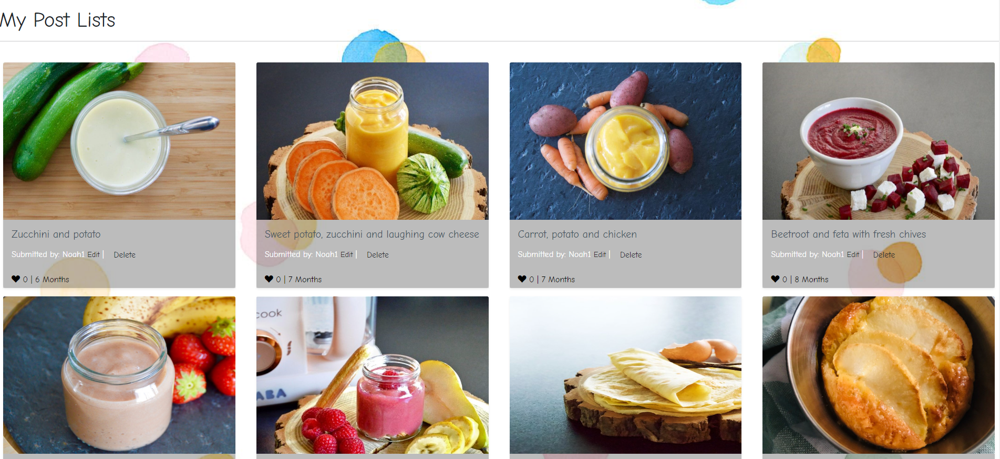

<h1 align="center">Babylicious Blog, a blog to share your recipies that you made with love for your baby</h1>

[Live Project Here](https://project-portofolio4-babyfood.herokuapp.com/)

# Babylicious Blog - Introduction

This project is a Full Stack website built using the Django framework. Babylicious Blog is a blogwith baby recipes where users can look, search or post a recipe for their baby. When the user is logged in they can also like/unlike a post and comment on a post. They can also share their favourite baby recipies by adding a post and upload or update their user image and details.

README Table Content

- [Babylicious Blog - Introduction](#babylicious-blog---introduction)
  - [User Experience - UX](#user-experience---ux)
    - [User Stories](#user-stories)
    - [Agile Methodology](#agile-methodology)
    - [The Scope](#the-scope)
      - [Main Site Goals](#main-site-goals)
  - [Database Diagram](#database-diagram)
  - [Design](#design)
      - [Typography](#typography)
    - [Wireframes](#wireframes)
  - [Features](#features)
    - [Home Page](#home-page)
    - [About Page](#about-page)
    - [Post Detail Page - Top](#post-detail-page---top)
    - [Post Detail Page - Steps](#post-detail-page---steps)
    - [Post Detail Page - Comments](#post-detail-page---comments)
    - [Edit Comments Page](#edit-comments-page)
    - [Categories Page](#categories-page)
    - [Books Page](#books-page)
    - [Add/Edit Recipie Page](#addedit-recipie-page)
    - [Search Box](#search-box)
    - [Search Results Page](#search-results-page)
    - [Search Results - Input Empty](#search-results---input-empty)
    - [Search Results - No Results Found](#search-results---no-results-found)
    - [Signup Page](#signup-page)
    - [Login Page](#login-page)
    - [Logout Page](#logout-page)
    - [User Profile Page](#user-profile-page)
    - [Navbar](#navbar)
    - [Herosection](#herosection)
    - [Footer](#footer)
  - [Messages and Interaction With Users](#messages-and-interaction-with-users)
    - [Sign up](#sign-up)
    - [Login](#login)
    - [Logout](#logout)
    - [Profile Update](#profile-update)
    - [Like Post](#like-post)
    - [Unlike Post](#unlike-post)
    - [Comment Post](#comment-post)
    - [Comment Post - 2](#comment-post---2)
    - [Delete/Edit Comment](#deleteedit-comment)
    - [Delete Comment - 1](#delete-comment---1)
    - [Delete Comment - 2](#delete-comment---2)
    - [Edit Comment](#edit-comment)
    - [Add Post](#add-post)
    - [Edit Post](#edit-post)
    - [Delete Post 1](#delete-post-1)
    - [Delete Post 2](#delete-post-2)
  - [Technologies Used](#technologies-used)
    - [Languages Used](#languages-used)
      - [Django Packages](#django-packages)
    - [Frameworks - Libraries - Programs Used](#frameworks---libraries---programs-used)
    - [Testing](#testing)
  - [Deployment of This Project](#deployment-of-this-project)
  - [Final Deployment](#final-deployment)
  - [Forking This Project](#forking-this-project)
  - [Cloning This Project](#cloning-this-project)
  - [Credits](#credits)
    - [Content](#content)
    - [Information Sources / Resources](#information-sources--resources)
  

  ## User Experience - UX

### User Stories

* As a website user, I can:

1. Navigate around the site and easily view the desired content.
2. View a list of recipes for babies and choose accordingly.
3. Search recipes to find specific recipes.
4. Click on post to read the recipe details.
5. Register for an account to avail of the services offered to members.
6. View the number of likes on a recipe.

* As logged in website user, I can:

1. Like/unlike recipes I enjoyed.
2. Comment/reply on recipes and give my opinion about the posts.
3. Delete my previous comments.
4. Manage my profile by updating my details and user image.
5. Share my favourites recipies by posting them on the Page.
6. Edit my favourite baby recipies posted previously.
7. Delete my favourite recipies posted previously.
8. Logout from the website.

* As a website superuser, I can:

1. Create and publish a new recipe.
2. Create a new user, recipes and categories.
3. Delete user, recipes, categories and comments.
4. Edit user's favourite recipies that was posted previously.
5. Delete user's favourite recipies that was posted previously.

### Agile Methodology

All functionality and development of this project were managed using GitHub which Projects can be found
[here](https://github.com/ionelaSabinaMacovei/ProjectPortofolio4-Babyfood/issues)

### The Scope

#### Main Site Goals

 * A simple, straightforward, intuitive UX experience;
 * Explicit content;
 * An easy navigation for the user through all the pages and features;
 * A site that is visually appealing on all screen sizes.

## Database Diagram

 

## Design

#### Typography

* The Comic Neue font is used as the main font for the whole project.

### Wireframes

Wireframes for this project can be located [here](WIREFRAMES.md)

## Features

### Home Page

* On the home page the  users can see a selection of 6 recipes, the navbar and 7 dropdown images which give to the user informations about each categorie . 

### About Page

* The About Page gives, users information about the Babylicious Blog website. It introduces the users to the
website. 

### Post Detail Page - Top

* At the top of the Post Details Page, users can see the post's main
image and they can also have access to information about the post. The
post information includes recipe name, author name, image and when was posted. 

### Post Detail Page - Steps

* In this page section, users can read the ingredients and follow the steps to complete the recipe. Also at the buttom of this the user can se the number of likes, category, the number of comments and the option to like/unlike the post.  

### Post Detail Page - Comments

* At the bottom of this page, If the user is logged can post and read comments posted by other users. If the user is logged in or is a 
superuser they have access to the buttons for deleting or updating comments. Also the user can reply to other users comments.

### Edit Comments Page

* On this page, users are allowed to comment, delete and edit their own post comments.

### Categories Page

  

* On the Categories Page, users can access the post filtered by the chosen category.

### Add/Edit Recipie Page

On this page, registered users can fill out the form to add or edit a post with their favourite recipie.

### Search Box

* In this box, the users can search by inputting a keyword in the search tool. This allows the user to try and find 
  the recipe they are looking for.

### Search Results Page

* On the Search Results Page, users can see the recipes found by their search.  When their recipe is located, the user can go to the 
  Post Details Page by clicking on the card result.

### Search Results - Input Empty

* On the Search Results Page - Input Empty, users will see this message if their search returns with an empty input.

### Search Results - No Results Found

* On the Search Results Page - No Results Found, users will see this message if there is nothing found for the search.

### Signup Page

* On the Signup Page, a new user can sign up for the Babylicious Blog website by filling out and then submitting the form.

### Login Page

* On the Login Page, users can log in to the website by inputting the username and password and have access 
  to website services for a user registered.

### Logout Page

* On the Logout Page, users can confirm that they wish to exit the website.

### User Profile Page

* On the Profile Page, users have access to their own information and can update their user name, email and profile image. Also they can see all their posts and they delete theit profile

### Navbar

* The navigation bar is present at the top of every page and houses all links to the various other pages.
* The options to Register or Log in will change to the option to log out once a user has logged in.
* Once a user has signed in, more options such as add post, profile page and user image will be available in the navbar.
* A search box is nested in the navbar.
* The navbar is fully responsive, collapsing into a hamburger menu when the screen size becomes smaller.

### Herosection

* In the herosection users can access the categories list by clicking on the dropdown menu. Also the dropdown images will display informations about each category

### Footer

* On the website footer, users can see basic information about the blog such as social media, 
  copyright, and a quote about baby diversification.

## Messages and Interaction With Users

* Some interactive messages were added to the project to make the navigation on the website easier and to improve the
user's experience.

### Sign up

* When users sign up to the website they will see a message at the top of the page saying "Successfully signed in as
(username)". 

### Login

* When users sign in to the website they will see a message at the top of the page saying "Successfully signed in as
(username)". 

### Logout

* When users log out of the website they will see a message at the top of the page saying "You have signed out". 
  
### Profile Update

* When users update their profile they will see a message at the top of the page saying that their account has been updated. 

### Like Post

* *When users are logged in to the website they can like a post and they will see a message at the top of the page 
  saying "You have liked this post". 

### Unlike Post

* When users are logged in to the website they can unlike a post that has been liked by the user and they will see a message 
  at the top of the page saying "You have unliked this post". 

### Delete/Edit Comment

* When users are logged in to the website and they have previously posted a comment or if the user is a superuser they will see the 
Delete and Edit buttons at the bottom of comments. 

### Delete Comment - 1

* If they wish to delete their comment, they can press the button Delete and a Bootstrap box model will pop up with the message 
  "Are you sure you want to delete your comment?". 

### Delete Comment - 2

* After pressing the Delete button again inside the Bootstrap box model they will see a message on the 
  top of the page, "Your comment was deleted successfully". 

### Edit Comment

* After pressing the Update, users will see a message on the top of the page, "The comment was successfully updated". 

### Add Post

  

* When users are logged in to the website they can publish a post with a favourite baby recipie and after they submit the 
post they will see a message at the top of the page saying "Successfully added post". 

### Edit Post

  
* When users are logged in to the website they can edit their own previously published posts and they will see the message 
  "Successfully updated post" after pressing the Submit button. 

### Delete Post 1 

When users are logged in to the website and they wish to delete their posts, they can press the button Delete and a 
Bootstrap box model will pop up with the message "Are you sure you want to delete your post?".   

### Delete Post 2

  

* After pressing the Delete button again inside the Bootstrap box model they will see a message on the 
  top of the page, "Post deleted!". 

## Technologies Used

### Languages Used

* [HTML 5](https://en.wikipedia.org/wiki/HTML/)
* [CSS 3](https://en.wikipedia.org/wiki/CSS)
* [JavaScript](https://www.javascript.com/)
* [Django](https://www.python.org/)
* [Python](https://www.djangoproject.com/)

#### Django Packages

* [Gunicorn](https://gunicorn.org/) 
   As the server for Heroku
* [Cloudinary](https://cloudinary.com/) 
   Was used to host the static files and media
* [Dj_database_url](https://pypi.org/project/dj-database-url/) 
   To parse the database URL from the environment variables in Heroku
* [Psycopg2](https://pypi.org/project/psycopg2/) 
   As an adaptor for Python and PostgreSQL databases
* [Summernote](https://summernote.org/) 
   As a text editor
* [Allauth](https://django-allauth.readthedocs.io/en/latest/installation.html) 
   For authentication, registration, account
   management
* [Crispy Forms](https://django-crispy-forms.readthedocs.io/en/latest/) 
   To style the forms

### Frameworks - Libraries - Programs Used

* [Bootstrap](https://getbootstrap.com/) 
   Was used to style the website, add responsiveness and interactivity
* [Jquery](https://jquery.com/) 
   All the scripts were written using jquery library
* [Gitpod](https://gitpod.io/)
	 Gitpod is used as version control software to commit and push code to the GitHub repository where the source code is stored.
* [GitHub](https://github.com/) 
   GitHub is used to store the project's code after being pushed from Git
* [Heroku](https://id.heroku.com) 
   Heroku was used to deploy the live project
* [PostgreSQL](https://www.postgresql.org/) 
   Database used through heroku.
* [Lucidchart](https://lucid.app/) 
   Lucidchart was used to create the database diagram
* [PEP8](http://pep8online.com/) 
   PEP8 was used to validate all the Python code
* [W3C - HTML](https://validator.w3.org/) 
   W3C- HTML was used to validate all the HTML code
* [W3C - CSS](https://jigsaw.w3.org/css-validator/) 
   W3C - CSS was used to validate the CSS code
* [Fontawesome](https://fontawesome.com/) 
   To add icons to the website
* [Google Chrome Dev Tools](https://developer.chrome.com/docs/devtools/) 
   To check App responsiveness and debugging
* [Google Fonts](https://fonts.google.com/) 
   To add the fonts that were used throughout the project
* [Balsamiq](https://balsamiq.com/) 
   To build the wireframes for the project
* [CANVA](https://www.canva.com/) 
   To build the logos for the project
* [Coolors](https://coolors.co/) 
   To build the colour palette of the project
* [Favicon](https://favicon.io/)
   Favicon.io was used to make the site favicon 
* [Am I Responsive](http://ami.responsivedesign.is/#)
   Multi Device Website Mockup Generator was used to create the Mock up image in this README

### Testing

Testing results [here](TESTING.md)

## Deployment of This Project

* This site was deployed by completing the following steps:

1. Log in to [Heroku](https://id.heroku.com) or create an account
2. On the main page click the button labelled New in the top right corner and from the drop-down menu select Create New
App
3. You must enter a unique app name
4. Next select your region
5. Click on the Create App button
6. Click in resources and select Heroku Postgres database
7. Click Reveal Config Vars and add a new record with SECRET_KEY
8. Click Reveal Config Vars and add a new record with the `CLOUDINARY_URL`
9. Click Reveal Config Vars and add a new record with the `DISABLE_COLLECTSTATIC = 1`
10. The next page is the project’s Deploy Tab. Click on the Settings Tab and scroll down to Config Vars
11. Next, scroll down to the Buildpack section click Add Buildpack select python and click Save Changes
12. Scroll to the top of the page and choose the Deploy tab
13. Select Github as the deployment method
14. Confirm you want to connect to GitHub
15. Search for the repository name and click the connect button
16. Scroll to the bottom of the deploy page and select the preferred deployment type
17. Click either Enable Automatic Deploys for automatic deployment when you push updates to Github

## Final Deployment 

1. Create a Procfile `web: gunicorn your_project_name.wsgi`
2. When development is complete change the debug setting to: `DEBUG = False` in settings.py
3. In this project the summernote editor was used so for this to work in Heroku add: `X_FRAME_OPTIONS = SAMEORIGIN `to
   settings.py.
4. In Heroku settings, delete the config vars for `DISABLE_COLLECTSTATIC = 1`
5. In Heroku, once all the variables are in place, locate 'Manual Deploy' > choose the master branch and click 'Deploy Branch'.
6. Once the app is built (it may take a few minutes), click 'Open App' from the top of the page.

## Forking This Project

* Fork this project by following the steps:

1. Open [GitHub](https://github.com/ionelaSabinaMacovei/ProjectPortofolio4-Babyfood)
2. Find the 'Fork' button at the top right of the page
3. Once you click the button the fork will be in your repository

## Cloning This Project

* Clone this project by following the steps:

1. Open [GitHub](https://github.com/ionelaSabinaMacovei/ProjectPortofolio4-Babyfood)
2. You will be provided with three options to choose from, HTTPS, SSH or GitHub CLI, click the clipboard icon in order
to copy the URL
3. Once you click the button the fork will be in your repository
4. Open a new terminal
5. Change the current working directory to the location that you want the cloned directory
6. Type 'git clone' and paste the URL copied in step 3
7. Press 'Enter' and the project is cloned

## Credits

### Content

* All food recipes and the images were taken from (https://www.cookingformybaby.com/en/) 
(https://www.ellaskitchen.co.uk/) 
(https://babyfoode.com/https://babyfoode.com/recipes/recipes/
) 
(https://www.healthylittlefoodies.com/category/recipes/
) 

* The Tasty Blog logos and favicon are my own design and build

### Information Sources / Resources

* [W3Schools - Python](https://www.w3schools.com/python/)
* [Stack Overflow](https://stackoverflow.com/)
* [Projects](https://github.com/KSheridan86/project-4-TasteOfIndia/tree/main/templates)
* [Projects](https://github.com/PedroCristo/portfolio_project_4)
* [Projects](https://github.com/paulie-o74/newsbox86)
* [Projects](https://github.com/somvirs57/school_learning_management)
* [Projects](https://github.com/Code-Institute-Solutions/Django3blog)
* [YouTube Tutorials](https://www.youtube.com/watch?v=ScABStHY8cc)
* [YouTube Tutorials](https://www.youtube.com/watch?v=KrGQ2Nrz4Dc)

