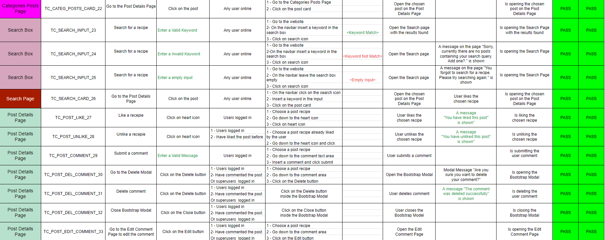
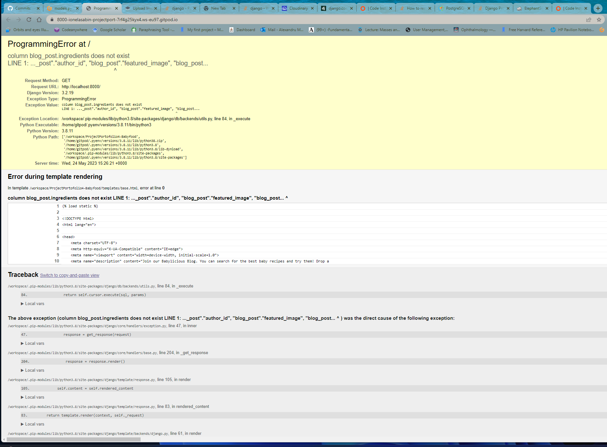

# Testing
Back to the [README](README.md)

* Testing has taken place continuously throughout the development of the project. Each view was tested regularly. 
  When the outcome was not as expected, debugging took place at that point.  

### Python Validation - PEP8
* Python testing was done using the PEP8 Online to ensure there were no syntax errors in the project. All python files
were entered into the online checker.

#### Blog
* [admin.py](static/extras/test/admin-blog.png)
* [apps.py](static/extras/test/apps-blog.png)
* [models.py](static/extras/test/models-blog.png)
* [forms.py](static/extras/test/forms-blog.png)
* [signals.py](static/extras/test/signals-blog.png)
* [urls.py](static/extras/test/urls-blog.png)
* [views.py](static/extras/test/views-blog1.png)
* A error were raised in the blog/views.py file, however these were related to default django authorisation
code and could not be changed to remove the errors(line to long).

#### Babyfood
* [asgi.py](static/extras/test/asgi-babyfood.png)
* [urls.py](static/extras/test/urls-babyfood.png)
* [wsgi.py](static/extras/test/wsgi-babyfood.png)
* [settings.py](static/extras/test/setings-babyfood.png)
* A few errors were raised in the babyfood/settings.py file, however these were related to default django authorisation
code and could not be changed to remove the errors(line to long).
* [views.py](static/extras/test/views-babyfood.png)

### Lighthouse
Lighthouse was used to test Performance, Best Practices, Accessibility and SEO on Desktop.

##### Desktop Results:
.

###### Mobile Results:
.

### HTML Validation
.

### CSS Validation

.
.
* Custom CSS was validated using W3C Jigsaw validation service. Twenty-three warnings were displayed, however, 
  these are related to vendor extension prefixes which will not affect the CSS performance.

## Manual Testing

The original Google sheet file for the manual testing report can be found [here](https://docs.google.com/spreadsheets/d/1jyXqMLt8xYcv7T4iBDfvAt6MWkkNOb9O3zaiBT0-dek/edit#gid=0)

### Backend/Admin Panel Testing

As a Site owner I want to be able to review all posts, categories, users, likes, etc.	So that I can maintain the site and remove any offensive content. 
 Given that I'm a Site owner When I navigate to the admin Then I should see all posts, categories, users, likes, etc.
 As a Site owner I want to be able to edit/update/delete a post.	So that I can maintain the site and remove any offensive content. 
  Given that I'm a Site owner When I navigate to the admin Then I should see be able to control all content on the website 
 As a Site owner I want to be able to ensure all areas of the site to function correctly and have no bugs. So that I can ensure an enjoyable browsing experience for all newcomers. 
 Given that I'm a Site owner When I check all site functionality Then I should see that everything works as expected, there are no bugs and all links and forms work as expected 

## Bugs

1. 
- Expected - Displays users posts on Profile page.
- Testing - Login and go on to the Profile Page.
- Result - Posts dosent appear on the Profile Page.
- Fix - Add the query set to the template context in the profile_view.

2. 
- Expected - Displays comments.
- Testing - Login user try to add a comment .
- Result -  404 Error(Page not found).
- Fix - Add the comments to the context variable before returning it.

3. 
- Expected - Displays the modal for delete comments.
- Testing - Login user click on the delete button .
- Result -  Show the user the modal from delete posts.
- Fix - Set unique ids  to 'unhide' the correct modal.

4. 
- Expected - Displays the modal for delete comments.
- Testing - Login user click on the delete button .
- Result -  Show the user the modal from delete posts.
- Fix - Set unique ids  to 'unhide' the correct modal.

5. 
- Expected - Displays the web page.
- Testing - Run the server .
- Result 

- Fix - Reset the database in Gitpod and in Elephantsql.

6. 
- Expected - Display the searched post.
- Testing - Type a random word in the serarch field .
- Result -  Searching only the title.
- Fix - Use Q __icontains and the pipe to signify or and added name and content.

7. 
- Expected - Display Google Fonts used.
- Testing - Run the server.
- Result -  Do not display the google fonts.
- Fix - Changed the font-family on the body element to 'Chewy' and then, cleared the cache.

8. 
- Expected - Display collapsable buttons.
- Testing - Clik on the collapsable button.
- Result -  Not working(do not appear the text).
- Fix - Moved the bootstrap javascript file just above the closing </body> tag in the base.html and used <button> instead of an <a> tag